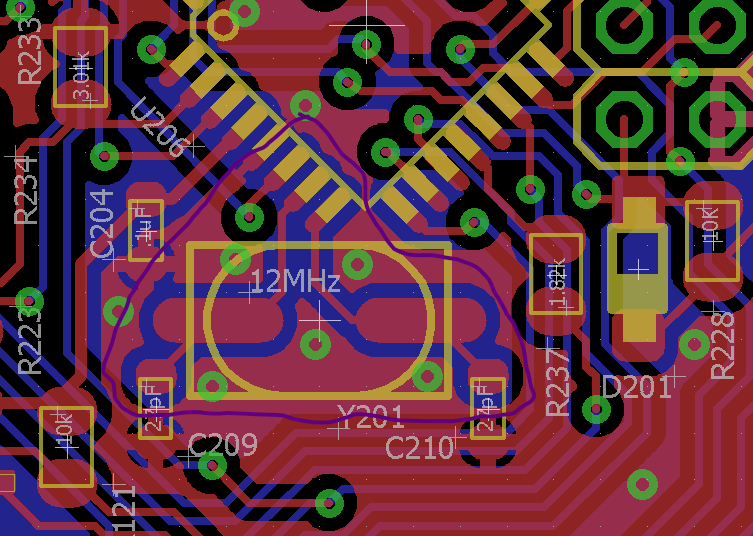

# Crystal Layout

More than a few have run into problems with low power crystal layouts. Microchip has included some guidelines in their AVR128DB datasheet that give some clues to the issues.

 - The crystal circuit must be placed on the same side of the board as the device. To reduce parasitic capacitance and improve immunity; place the crystal circuit close to the oscillator pins, and avoid long traces.  The load capacitors need to be placed next to the crystal and on the same side of the board.

 - Place a grounded copper area around the crystal circuit to isolate it from surrounding circuits. If the circuit board has two sides, the copper on the bottom side must be solid and cover the crystal circuit area. The copper area on the top layer must surround the crystal circuit and tie to the bottom layer area using via(s).

 - Do not run any signal traces or power traces inside the grounded copper area. Avoid routing digital lines, especially clock lines, close to the crystal traces. 
 - If using a two-sided PCB, avoid any traces beneath the crystal. For a multilayer PCB, avoid routing signals below the crystal between the ground area.

The ATMEGA328PB and ATMEGA324PB have low power crystal drivers that have given numerous people issues, but if they follow the above practices, their problems would be lessened. This image is a layout example of a mega328pb somewhat marked to show the top copper area around the crystal circuit that isolates.

!

There is one trace within that ground loop that is not ideal, it is an I2C clock line, but I have minimized its impact on the crystal operation since I needed its function.